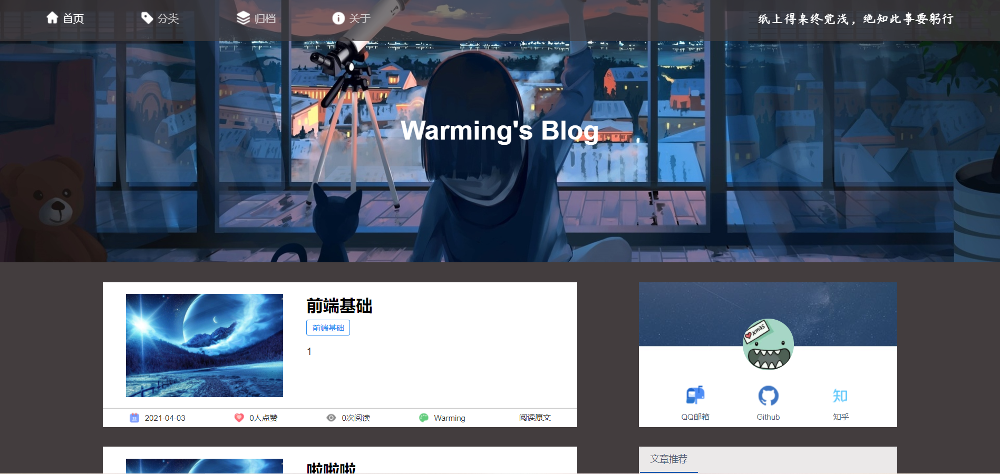

# VueBLOG
 Vue.js+Node.js+Mongodb+Express的前后端分离的个人博客
 
 ## 主要技术构成
前端主要技术栈为vue.js、vue-router、 axios

后端主要技术栈为node.js、 mongodb、 Express

视图框架：iview

## 博客功能
### 前台页面
- 文章目录
- 动态显示文章
- 点赞
- 留言
- 文章分类显示
- 归档


### 后台管理页面
- 文章的增删改查
- 权限验证
- 登录验证
- markdown编辑器

## Setup

运行环境
- node.js
- mongoDB

克隆远程库
```
git clone git@github.com:Hao-Warming/VueBLOG.git
```
进入项目目录VueBlog后，安装依赖
```
npm install
```
运行server文件夹下的app.js，该文件为服务器开关。（确保数据库mongodb已经启动）

在8080端口热重载开发，等待一会后，会自动弹出浏览器窗口
```
npm run serve
```

### 注意
- 账户：admin 密码：aa123456
- 进入后台管理页面只需在URL后面添加路径"/admin"，登陆后即可进入
- 确保本地安装好mongodb


### 效果展示
#### 前台效果

首页



### 目录
```
│  babel.config.js      babel配置
│  .gitignore           git上传忽略
│  .env.development     
│  .env.production
│  vue.config.js        项目配置
│  package.lock.json
│  package.json
│  README.md
│  
│
├─public
│
├─server                服务端
│      │
│      ├─ api           api接口
│      │
│      ├─ db            数据库
│      │
│      ├─ middlewares   中间件
│      │
│      ├─app.js
│     
│
├─src
│   │  main.js        项目入口
│   │  App.vue          根组件
│   │
│   ├─assets          文件资源
│   │  ├─css
│   │  |─font
│   │  └─images
│   │
│   ├─components      vue组件
│   │  ├─back         后台组件
│   │
│   ├─ plugin        
│   │
│   ├─router          路由
│   │
│   └─views           视图文件
│_
```
